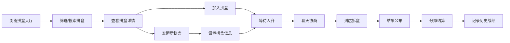

## 1. 产品概述

面向喜欢现场拆盒、讲究时效的潮玩玩家的同城闪电拼盒平台。用户可快速发起或加入拼盒，系统自动匹配附近想拼同款的人，在短时间内把一整盒拆分成可控、透明的同城合作单。

- 核心价值：解决单人整盒购买成本高、隐藏款难求的痛点，通过同城拼盒降低门槛、提升效率
- 目标用户：18-35岁潮玩爱好者，追求现场拆盒体验，讲究时效和性价比

## 2. 核心功能

### 2.1 用户角色

| 角色 | 注册方式 | 核心权限 |
|------|----------|----------|
| 普通用户 | 手机号注册 | 发起/加入拼盒、聊天、查看历史战绩 |
| 发起人 | 普通用户升级 | 设置拼盒规则、管理成员、确认结果 |

### 2.2 功能模块

1. **拼盒大厅**：浏览拼盒列表、筛选城市/商圈/系列、搜索功能
2. **发起拼盒**：选择城市、商圈、到店时间、目标系列、分配规则
3. **拼盒详情**：剩余卡位、各自预算、凑单进度、倒计时、成员列表
4. **聊天协商**：群聊沟通、规则确认、临时补位/退出重配
5. **结果公布**：拆盒结果展示、隐藏款归属、分摊结算
6. **历史战绩**：个人拼盒记录、收藏系列、战绩统计

### 2.3 页面详情

| 页面名称 | 模块名称 | 功能描述 |
|----------|----------|----------|
| 拼盒大厅 | 顶部导航 | Logo、搜索、城市切换、个人中心入口 |
| 拼盒大厅 | 筛选区域 | 城市、商圈、系列、时间、价格区间筛选 |
| 拼盒大厅 | 拼盒列表 | 卡片展示拼盒信息，包含系列、剩余卡位、倒计时、距离 |
| 拼盒大厅 | 发起按钮 | 悬浮发起拼盒按钮 |
| 发起拼盒 | 选择城市 | 城市选择器，热门城市推荐 |
| 发起拼盒 | 选择商圈 | 商圈列表，显示距离和人气 |
| 发起拼盒 | 选择时间 | 日期时间选择，最快30分钟后 |
| 发起拼盒 | 选择系列 | 潮玩系列选择，显示价格和热度 |
| 发起拼盒 | 规则设置 | 分配规则（隐藏款优先/普通款均分/按序轮转）、人数、预算 |
| 拼盒详情 | 头部信息 | 系列封面、标题、状态标签、倒计时 |
| 拼盒详情 | 凑单进度 | 进度条、已凑/总人数、剩余时间 |
| 拼盒详情 | 卡位列表 | 成员头像、昵称、预算、占位状态 |
| 拼盒详情 | 规则说明 | 分配规则、取货方式（到店自提/代取/同城送达） |
| 拼盒详情 | 操作区域 | 加入拼盒、分享、联系发起人 |
| 聊天协商 | 消息列表 | 聊天记录、系统消息、成员操作记录 |
| 聊天协商 | 输入区域 | 文字输入、表情、快捷操作 |
| 结果公布 | 拆盒展示 | 盲盒逐个展示动画、隐藏款高亮 |
| 结果公布 | 归属明细 | 各款式归属人、分摊金额 |
| 结果公布 | 结算区域 | 总金额、人均金额、支付按钮 |
| 历史战绩 | 战绩统计 | 拼盒次数、隐藏款数量、总花费 |
| 历史战绩 | 记录列表 | 历史拼盒卡片，可查看详情 |

## 3. 核心流程

用户打开应用后浏览拼盒大厅，可筛选城市和系列找到心仪的拼盒；点击进入详情页查看卡位和规则，确认后加入拼盒；人齐后进入聊天协商环节，确认到场时间和取货方式；到店拆盒后公布结果，按规则分配款式并分摊结算；最后记录到历史战绩中。

## 4. 用户界面设计

### 4.1 设计风格

- **主色调**：深紫色 (#1a0a2e) 作为主背景，霓虹粉 (#ff2d95) 和电光蓝 (#00d4ff) 作为点缀色
- **辅助色**：金色 (#ffd700) 用于高亮隐藏款，荧光绿 (#39ff14) 用于成功状态
- **字体**：展示字体使用 Orbitron（科技感），正文字体使用 Noto Sans SC（清晰可读）
- **按钮风格**：渐变霓虹边框按钮，悬停时有发光效果
- **布局风格**：卡片式布局，深色背景配合玻璃拟态效果
- **图标风格**：线性霓虹图标，发光效果
- **整体调性**：赛博朋克潮流风，符合潮玩年轻、酷炫的品牌调性

### 4.2 页面设计概览

| 页面名称 | 模块名称 | UI元素 |
|----------|----------|--------|
| 拼盒大厅 | 顶部导航 | 渐变Logo、霓虹搜索框、城市选择胶囊按钮 |
| 拼盒大厅 | 筛选区域 | 横向滚动标签、发光选中效果 |
| 拼盒大厅 | 拼盒卡片 | 玻璃拟态卡片、系列封面图、霓虹倒计时、进度条 |
| 拼盒大厅 | 悬浮按钮 | 渐变圆形按钮、+号发光动画 |
| 拼盒详情 | 头部 | 大图封面、渐变遮罩、状态徽章 |
| 拼盒详情 | 进度区 | 霓虹进度条、跳动数字倒计时 |
| 拼盒详情 | 卡位区 | 圆形头像、占位动画、预算标签 |
| 结果公布 | 拆盒动画 | 盲盒翻转效果、隐藏款金光照亮 |
| 聊天协商 | 消息气泡 | 玻璃拟态气泡、系统消息特殊样式 |

### 4.3 响应式

- 桌面端优先设计，适配平板和移动端
- 移动端优化触控区域，底部导航栏
- 卡片列表在移动端改为单列，桌面端双列或三列
- 确保所有交互元素在移动端有足够触控面积 (≥44px)

### 4.4 动效设计

- 页面切换：渐入渐出 + 轻微位移
- 拼盒卡片：悬停上浮 + 霓虹光晕增强
- 倒计时：数字跳动动画，最后5分钟红色闪烁警示
- 拆盒结果：盲盒翻转3D动画，隐藏款有金光爆发效果
- 消息发送：气泡弹入动画
- 进度条填充：发光流动效果
