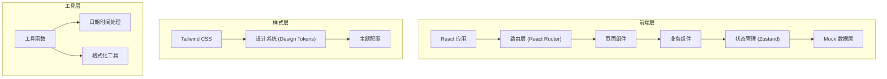
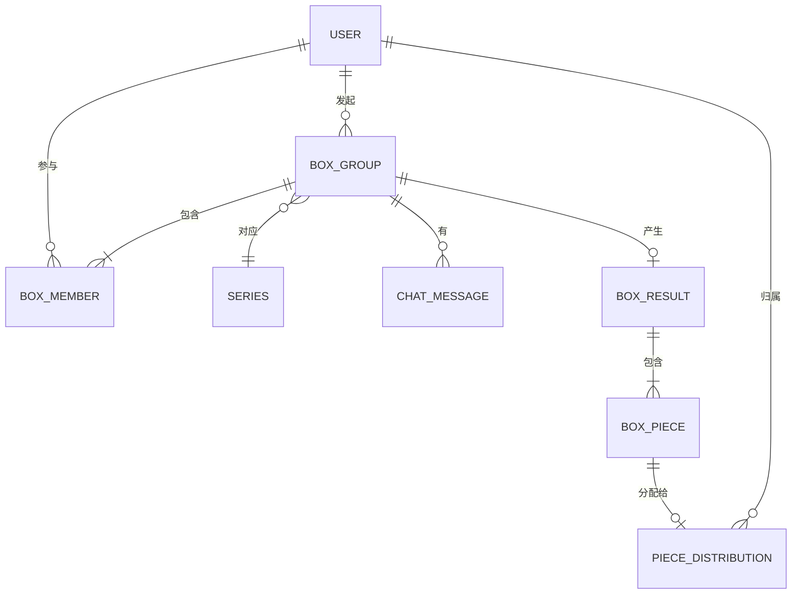

## 1. 架构设计



## 2. 技术描述

- **前端框架**：React 18 + TypeScript
- **构建工具**：Vite 5
- **样式方案**：Tailwind CSS 3 + CSS 变量主题系统
- **路由管理**：React Router DOM 6
- **状态管理**：Zustand（轻量级状态管理）
- **图标库**：Lucide React（配合霓虹发光效果）
- **动画方案**：CSS 动画 + Framer Motion（复杂动效）
- **数据来源**：Mock 数据模拟，本地存储持久化

## 3. 路由定义

| 路由路径 | 页面名称 | 功能描述 |
|----------|----------|----------|
| / | 拼盒大厅 | 浏览、筛选、搜索拼盒列表 |
| /create | 发起拼盒 | 创建新拼盒，设置城市/商圈/时间/系列/规则 |
| /box/:id | 拼盒详情 | 查看拼盒详细信息、卡位、进度、倒计时 |
| /box/:id/chat | 聊天协商 | 拼盒群聊、规则确认、临时补位 |
| /box/:id/result | 结果公布 | 拆盒结果展示、隐藏款归属 |
| /box/:id/payment | 分摊结算 | 费用分摊、支付确认 |
| /history | 历史战绩 | 个人拼盒记录、战绩统计 |

## 4. 数据模型

### 4.1 核心数据类型

```typescript
// 用户信息
interface User {
  id: string;
  nickname: string;
  avatar: string;
  city: string;
  totalBoxes: number;
  hiddenCount: number;
}

// 潮玩系列
interface Series {
  id: string;
  name: string;
  brand: string;
  coverImage: string;
  price: number;
  totalPieces: number;
  hiddenName: string;
  hiddenImage: string;
  popularity: number;
}

// 拼盒信息
interface BoxGroup {
  id: string;
  seriesId: string;
  series: Series;
  city: string;
  district: string;
  storeName: string;
  meetTime: Date;
  status: 'recruiting' | 'full' | 'ongoing' | 'completed';
  totalSlots: number;
  filledSlots: number;
  members: BoxMember[];
  rule: DistributionRule;
  pickupMethod: PickupMethod;
  createdAt: Date;
  countdownMinutes: number;
  initiatorId: string;
}

// 拼盒成员
interface BoxMember {
  userId: string;
  user: User;
  budget: number;
  slotIndex: number;
  status: 'confirmed' | 'pending' | 'exited';
  joinedAt: Date;
}

// 分配规则
type DistributionRule = 'hidden_priority' | 'average' | 'rotation';

// 取货方式
type PickupMethod = 'self_pickup' | 'proxy' | 'delivery';

// 拆盒结果
interface BoxResult {
  boxGroupId: string;
  pieces: BoxPiece[];
  distribution: PieceDistribution[];
  totalCost: number;
  perPersonCost: number;
}

// 单个盲盒
interface BoxPiece {
  id: string;
  name: string;
  image: string;
  isHidden: boolean;
  rarity: 'common' | 'rare' | 'hidden';
}

// 款式分配
interface PieceDistribution {
  pieceId: string;
  userId: string;
}

// 聊天消息
interface ChatMessage {
  id: string;
  boxGroupId: string;
  userId: string;
  user: User;
  content: string;
  type: 'text' | 'system';
  timestamp: Date;
}
```

### 4.2 数据模型 ER 图



## 5. 项目目录结构

```
src/
├── assets/              # 静态资源
│   ├── images/
│   └── fonts/
├── components/          # 通用组件
│   ├── ui/             # 基础UI组件
│   │   ├── Button.tsx
│   │   ├── Card.tsx
│   │   ├── Badge.tsx
│   │   ├── ProgressBar.tsx
│   │   └── Countdown.tsx
│   ├── layout/         # 布局组件
│   │   ├── Header.tsx
│   │   ├── BottomNav.tsx
│   │   └── Container.tsx
│   └── features/       # 业务组件
│       ├── BoxCard.tsx
│       ├── SlotList.tsx
│       └── ChatBubble.tsx
├── pages/               # 页面组件
│   ├── HallPage.tsx
│   ├── CreateBoxPage.tsx
│   ├── BoxDetailPage.tsx
│   ├── ChatPage.tsx
│   ├── ResultPage.tsx
│   ├── PaymentPage.tsx
│   └── HistoryPage.tsx
├── store/               # 状态管理
│   ├── useBoxStore.ts
│   └── useUserStore.ts
├── data/                # Mock 数据
│   ├── mockSeries.ts
│   ├── mockBoxGroups.ts
│   └── mockUsers.ts
├── types/               # TypeScript 类型
│   └── index.ts
├── utils/               # 工具函数
│   ├── format.ts
│   └── date.ts
├── styles/              # 全局样式
│   └── index.css
├── App.tsx
├── main.tsx
└── vite-env.d.ts
```

## 6. 设计系统规范

### 6.1 颜色系统

| 变量名 | 色值 | 用途 |
|--------|------|------|
| --bg-primary | #0d0221 | 主背景色 |
| --bg-secondary | #1a0a2e | 次级背景/卡片背景 |
| --bg-glass | rgba(255,255,255,0.05) | 玻璃拟态背景 |
| --text-primary | #ffffff | 主要文字 |
| --text-secondary | #b8a9d4 | 次要文字 |
| --text-muted | #7b6fa0 | 辅助文字 |
| --accent-pink | #ff2d95 | 霓虹粉，主强调色 |
| --accent-blue | #00d4ff | 电光蓝，次强调色 |
| --accent-gold | #ffd700 | 金色，隐藏款高亮 |
| --accent-green | #39ff14 | 荧光绿，成功状态 |
| --accent-red | #ff3366 | 红色，警告/紧急 |
| --border-color | rgba(255,45,149,0.2) | 边框颜色 |

### 6.2 字体系统

- 展示字体：Orbitron - 用于标题、数字、倒计时
- 正文字体：Noto Sans SC - 用于正文、按钮、标签

### 6.3 间距系统

基于 4px 网格：
- xs: 4px
- sm: 8px
- md: 16px
- lg: 24px
- xl: 32px
- 2xl: 48px

### 6.4 圆角系统

- sm: 4px
- md: 8px
- lg: 12px
- xl: 16px
- full: 9999px
